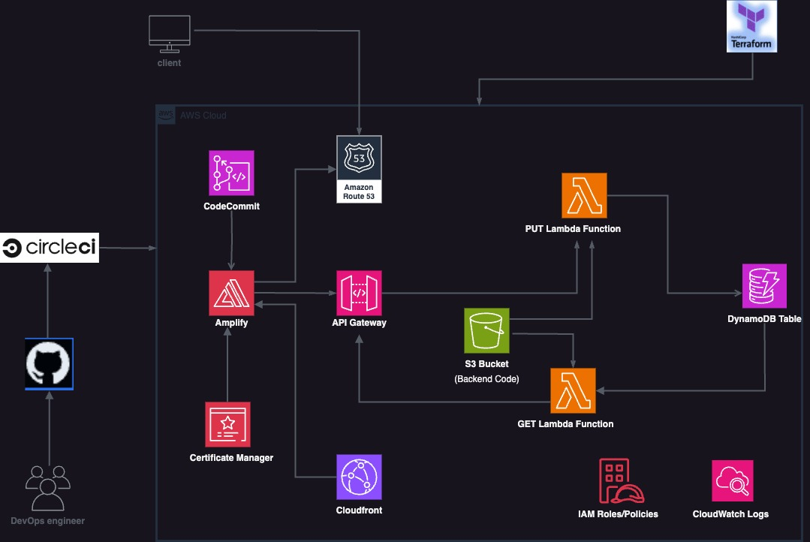

## Cloud Serverless Project
---

A full-stack AWS Serverless project showcasing the power of serverless architecture to deploy frontend and backend components seamlessly.

### Features
---

- **Serverless Deployment:** Utilize AWS Serverless Services for a scalable and cost-effective deployment.
- **Full Stack:** Frontend (HTML, CSS, JS) and Backend (Python) seamlessly integrated.
- **Database:** No SQL Database (DynamoDB) for efficient data storage.

### Frontend
---

The `Frontend` folder contains the HTML, CSS, and JS files responsible for the user interface and client-side functionalities. Customize these files to match your application's design.

### Backend
---

The `Backend` folder houses the backend logic written in Python. This includes Lambda functions that handle server-side processing and interactions with AWS services. Modify these files to tailor the backend to your specific needs.

### CircleCI Integration
---
This project leverages `CircleCI` for continuous integration and deployment. The CI/CD pipeline is configured to automatically build, test, and deploy changes to your AWS Serverless application. 

To integrate CircleCI, please follow these steps:

- Sign up or log in to CircleCI.
- Connect your GitHub account and add your repository.
- Configure the `.circleci/config.yml `file to match your project's structure and requirements.
- Push a commit to trigger the initial build and deployment on CircleCI.
- Monitor the build status on the CircleCI dashboard.

