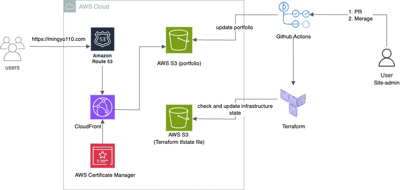

## The automation of personal website deployment and updates

### BackGround
___
- As a cloud computing solutions architect, I would love to assist clients in deploying their application architectures by sharing and implementing cloud-based infrastructures in an agile way. Here's an exemplary demonstration of automating the deployment and updating process for a personal website on AWS through GitHub Actions workflow and Terraform.

### Solution Architecture
___

- a. The static website can be hosted on AWS S3 and accessed with accelerated performance through the use of CDN ([AWS CloudFront](https://aws.amazon.com/cloudfront/)).
- b. The management and deployment of certificates are facilitated by [AWS Certificate Manager]( https://aws.amazon.com/certificate-manager/?nc1=h_ls), whereby **ACM** issued certificates are automatically renewed and associated with **AWS CloudFront**.
- c. **When opening a PR** meanwhile direct push to main branch will be disabled,and **pull_request** workflow will be triggered by PR so that **checkout the code**,**initialize terraform** and **terraform plan** will be executed automatically.
- d. **Merging the PR to master** When we get the desired output in the previous step (the terraform plan) ,we will merge the Pull Request(PR) and this **merge_main** workflow will be triggered.
- e. **Please be noted that** [Infracost](https://dashboard.infracost.io/) which is **a Shift FinOps Left** tool that can let you know your cost impact of Cloud Infrastructure Changes is integrated in the **Pull Request Workflow** in order to control your cost.
### Prerequisites
___
- AWS Account or other Cloud Service Provider's Account
- Be familiar with AWS or other Cloud Service Provider
- Be familiar with Terraform
- Be familiar with GitHub Actions
- Be familiar with Front-end web application development

### Contact

---
- -[LinkedIn](https://www.linkedin.com/in/jack-liu-b73b7b2a8/)
- -[GitHub](https://github.com/mingyu110) 
- -[X](https://x.com/Jinxun_Liu)

