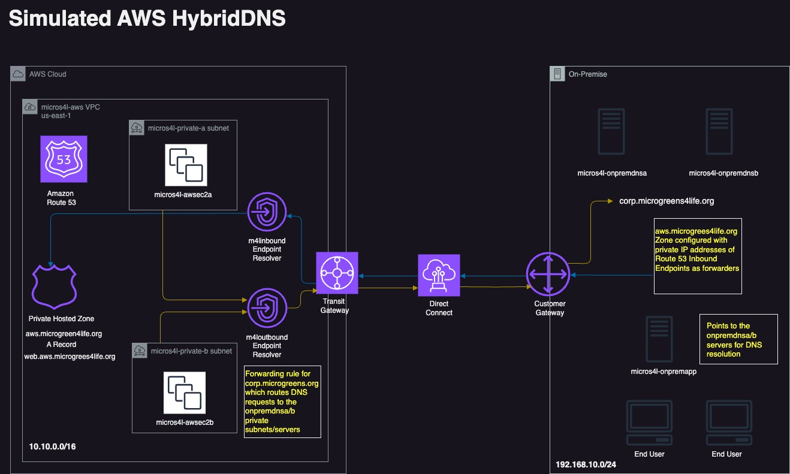
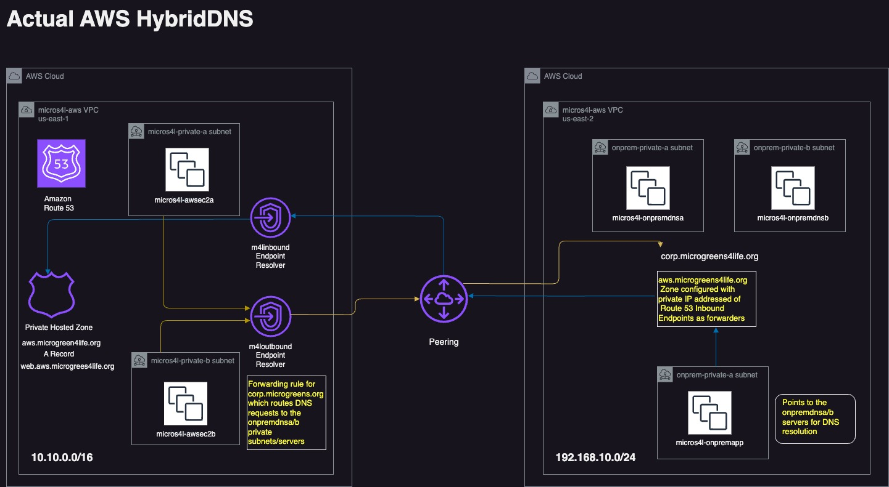

### Overview
The objective of this runbook is to showcase the implementation of an AWS Hybrid DNS design and architecture between an AWS region hosting exclusively private subnets and an on-premises private corporate data center. The purpose of this design is to simulate a hybrid DNS cloud connectivity setup to an on-premises environment using AWS DirectConnect (DX). However, the actual implementation will provide private DNS resolution over a well-established inter-region AWS VPC Peering connection through various Route 53 services and Linux Bind DNS server components as elaborated below.

### Pre-requisites

- GitHub Account
- AWS Account
- AWS configuration and credentials [setup](https://docs.aws.amazon.com/cli/latest/userguide/cli-configure-files.html)
- Terraform [installed](https://developer.hashicorp.com/terraform/tutorials/aws-get-started/install-cli)

### Diagrams


### Architecture
The us-east-2 region will be hosting the micros4l-onprem VPC with a prefix of 192.168.10.0/24 also containing 2 private subnets. Two t2.micro EC2 instances will be deployed here in separate subnet/availability zones called micros4l-onpremdnsa/b and configured with Bind and the zone corp.microgreens4life.org. Additionally, the zone for aws.microgreens4life.org will be configured on these servers with forwarders set to the AWS Inbound endpoint IP addresses in order to forward requests for the Web subdomain to the AWS Route 53 resolvers. A third basic t2.micro EC2 instance called micros4l-onpremapp will be deployed which we'll use for testing DNS resolution from "on-prem" to AWS (us-east-1).

The us-east-1 region will be hosting the micros4l-aws VPC with a prefix of 10.10.0.0/16 containing 2 private subnets - note the non-overlapping private IP space between the environments as this is a requirement for VPC peering in addition to DirectConnect (DX) connectivity which is being simulated. Two basic t2.micro EC2 instances, micros4l-awsec2b/b will be deployed here for testing DNS resolution into our simulated Corporate on-prem datacenter. Each instance is deployed in a separate subnet/availability zone. The Route 53 private hosted zone for aws.microgreens4life.org with an A record of web.aws.microgreens4life.org is configured here. Additionally, Route 53 Inbound and Outbound endpoints are hosted here where each endpoint gets associated with both of the us-east-1 private subnets. The Outbound endpoint will have a forwarding rule for the corp.microgreens4life.org zone associated with it which targets the micros4l-onpremdnsa/b Bind servers hosted "on-prem" (us-east-2) to resolve outbound requests to the Corporate subdomains.

All instances will be deployed with settings configured to allow Systems Manager connectivity as this is the only way to connect to these private instances in this environment as none of them will be deployed with a public IP address nor is there any internet gateway created - these are completely isolated, private environments.
### Procedure
1. Navigate to the `/global/iam` directory and run terraform plan/apply:
```
cd aws-terraform-hybrid-dns/global/iam
terraform plan
terraform apply
```
Resources deployed in this terraform module:
>* `roles.tf` - IAM instance policy, roles and policy attachments which all EC2 instances in this design will utilize
>* `s3.tf` - S3 bucket for storing the terraform state files. Update your bucket name here as it must be globally unique

2. Navigate to the `/us-east-2` directory and run terraform plan/apply:
```
cd aws-terraform-hybrid-dns/us-east-2
terraform plan
terraform apply
```
Resources deployed in this terraform module:
>* `ec2.tf` - micros4l-onpremdnsa/b simulating on-prem Linux Bind/DNS servers and micros4l-onpremapp Linux server
>* `vpc.tf` - VPC with prefix 192.168.10.0/24, 2x private subnets, private route table associated with the 2x subnets, Security Group and rules allowing SSM access and DNS requests, VPC Endpoints for SSM connectivity

3. Capture the outputs from the /us-east-2 module deployment and save them in a temp text file for use as input in the next step. For example:
```
onprem-private-rt_id = "rtb-0fae5266503453da8"
onpremdnsa_ip = "192.168.10.11"
onpremdnsb_ip = "192.168.10.236"
onpremvpc_id = "vpc-0ab74c12320891aa3"
```
4. Navigate to the /us-east-1 directory and run terraform plan/apply:
```
cd ../us-east-1
terraform plan
terraform apply
```
Resources deployed in this terraform module:
>* `ec2.tf` - micros4l-awsec2a/b AWS instances
>* `route53.tf` - aws.microgreens4life.org Route 53 hosted private zone, web.aws.microgreens4life.org A record, Route 53 Inbound endpoint, Route 53 Outbound endpoint for the corp.microgreens4life.org domain with a Forwarding rule pointing to the Corp on-prem environment (us-east-2)
>* `vpc.tf` - VPC with prefix 10.10.0.0/16, 2x private subnets, private route table associated with the 2x subnets, VPC Peering connectivity between the AWS us-east-1 region to the "on-prem" us-east-2 region, Security Group and rules allowing SSM access and DNS requests, VPC Endpoints for SSM connectivity

5. Capture the outputs from the /us-east-1 module deployment and save them in a temp text file for use as input in the next step. Note you'll only need the "ip" address output from each of the 2 endpoints. For example:
```
aws_route53_resolver_inbound_endpoint_ips = toset([
  {
 "ip" = "10.10.0.90"     <---- INBOUND_ENDPOINT_IP1
 "ip_id" = "rni-2bc122c23384d09af"
 "subnet_id" = "subnet-0e6a97614d0833b47"
  },
  {
 "ip" = "10.10.10.221"     <---- INBOUND_ENDPOINT_IP2
 "ip_id" = "rni-75c2ecfc30094b3a9"
 "subnet_id" = "subnet-0dce015d7ba12e0de"
  },
])
```
6. In the `awszone.forward `file, replace the INBOUND_ENDPOINT_IP1 and INBOUND_ENDPOINT_IP2 values of the forwarders with the Endpoint IP addresses from the outputs of the previous step.

7. From the AWS console, navigate to the EC2 instances in the us-east-2 region, select micros4l-onpremdnsa and initiate a connection to it via Session Manager. Enter sudo -i and with your editor of choice, vi or nano into the /etc/named.conf file. Scroll to the end of the file and paste the contents of your updated awszone.forward file, save and exit. Run the following command to restart bind service:
```
systemctl restart named 
systemctl status named 
```
Using dig or nslookup, test that your local DNS server is resolving the AWS Route 53 private zone/domain for aws.microgreens4life.org now that you've applied the Route 53 endpoint IP addresses into the Bind server's named.conf file. You should see it resolve to the 10.10.x.x private IP space of the us-east-1 AWS VPC where the Route 53 inbound endpoints are hosted. For example:
```
sh-4.2$ dig web.aws.microgreens4life.org @127.0.0.1 +short
10.10.0.172
10.10.10.31
```

8. Navigate to the EC2 instances in us-east-2 and select micros4l-onpremapp and initiate a connection to it via Session Manager. Enter sudo -i and with your editor of choice, vi or nano into the /etc/sysconfig/network-scripts/ifcfg-eth0 file. Scroll to the end of the file and paste the following contents replacing the THE_PRIVATE_IP_OF_ONPREM_DNS_A/B values with the actual private IP addresses of the onprem DNS servers which were given in the outputs of your terraform apply for the us-east-2 implementation in step 3.):
```
DNS1=THE_PRIVATE_IP_OF_ONPREM_DNS_A
DNS2=THE_PRIVATE_IP_OF_ONPREM_DNS_B
```
Restart the network services: systemctl restart network Run a test ping/dig from the micros4l-onpremapp instance to the AWS route 53 hosted subdomain:
```
ping web.aws.microgreens4life.org
dig web.aws.microgreens4life.org +short
```

9. Navigate back to the ec2 instances in us-east-1 and initiate a systems manager session on micros4l-awsec2a/b and test dns resolution of the onprem hosted subdomain:
```
ping app.corp.microgreens4life.org
dig app.corp.microgreens4life.org +short
```
10. Cleanup! Run a terraform destroy in each region/module of `us-east-1` and `us-east-2`:
```
terraform destroy
var.accepter_route_table_id
  Route table id of the accepter that you want to peer with it
  Enter a value: <Enter>
var.accepter_vpc_id
  VPC id that you want to peer with it
  Enter a value: <Enter>
var.onpremdnsa_priv_ip
  Private IP Address of micros4l-onpremdnsa
  Enter a value: 192.168.10.53 <-----onpremdnsa_ip
var.onpremdnsb_priv_ip
  Private IP Address of micros4l-onpremdnsb
  Enter a value: 192.168.10.243 <-----onpremdnsb_ip
```
